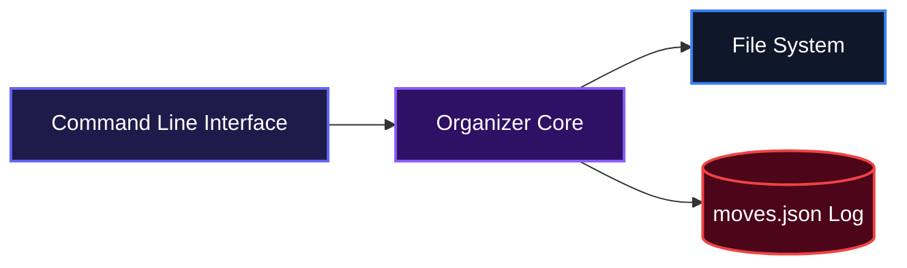
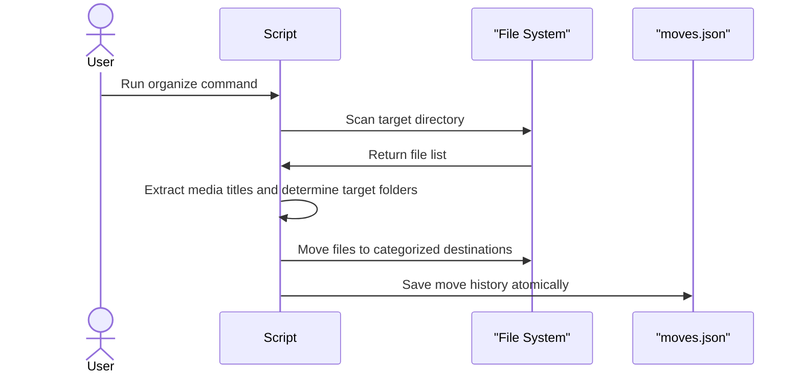
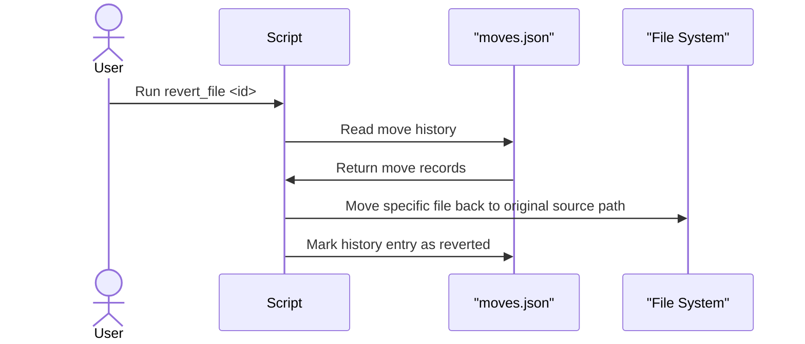

# File Organizer

File Organizer helps users automatically sort cluttered directories into categorized folders based on file types. It takes a messy target folder, groups files into specific categories like images or code, and moves them into clean subdirectories. This provides a straightforward way to keep file systems tidy without complex configurations.

## System Architecture



## Usage

Run the script with a command and, for `organize`, an optional target path:

```bash
py organizer.py organize [path]    # sort a directory into category folders
py organizer.py revert             # undo all file moves from the last organize run
py organizer.py revert_file <id>   # undo a specific file move using its history ID
py organizer.py history            # print the move log with IDs
py organizer.py clear              # wipe the move log
```

`organize` defaults to `~/Downloads/telegram_desktop` when no path is given, so you can pass an absolute path or a valid home-relative path to target any directory.

When organizing, the script iterates through the target directory, prints each file it finds, and shows exactly which folder it is being moved to. It generates an atomic `moves.json` file in the same directory as the script to log the original and new locations of every moved file, assigning each an ID so `revert` or `revert_file` can restore files to their original locations.

## Features

* Automatically sorts files by their extensions.
* Creates destination folders automatically if they do not exist.
* Groups common files into Code, Images, Audio, Video, Archive, and Documents.
* Intelligently parses video filenames using Guessit to group TV shows and movies into specific dedicated folders.



* Catches unrecognized extensions and moves them safely to an isolated Unknown folder.
* Safely skips directories to avoid breaking nested folder structures.
* Tracks all file movements with unique IDs in an atomic, crash-proof JSON log that automatically retries if files are locked.
* Includes both global and single-file revert functions to safely undo the organization process.



## Technologies Used

| Technology | Purpose |
| :--- | :--- |
| [Python](https://www.python.org/) | Core language environment |
| [Pathlib](https://docs.python.org/3/library/pathlib.html) | Object-oriented filesystem path handling |
| [Shutil](https://docs.python.org/3/library/shutil.html) | High-level file operations and moving |
| [JSON](https://docs.python.org/3/library/json.html) | State tracking and move history logging |
| [Guessit](https://guessit.readthedocs.io/en/latest/) | Extracts clean media titles from video file names |

## Author Info

* LinkedIn: https://linkedin.com/in/deelolade
* X (Twitter): https://x.com/deelolade

## Built With

[](https://www.python.org/)

[](https://dokugen.samueltuoyo.com)